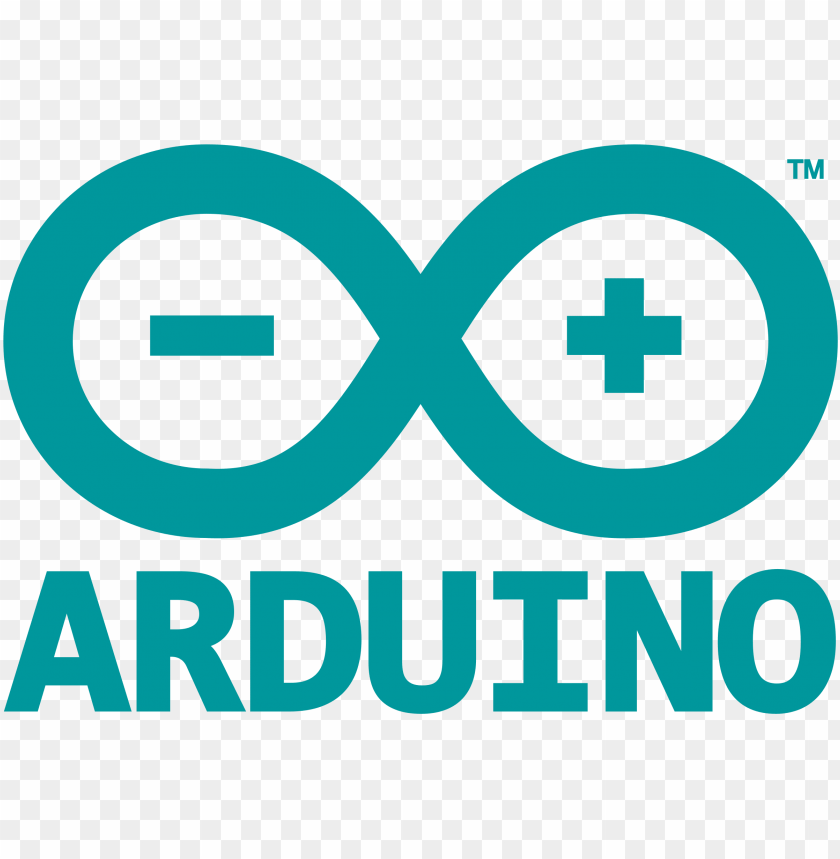

<!--markdown course for my github profile-->

# Sarwat Razzaque Choudhury 
<!--instagram profile-->
#### <bold>Social Media Profiles</bold>
[Instagram](https://www.instagram.com/sarwat_razzaque_chy/)  
[Facebook](https://www.facebook.com/sarwat.razzaquechy/)

#### <bold>Contact me:
Email: arabian.piratesarwat@gmail.com
</bold>

#### Programmer  <!--here two spaces have been included to create a new line, this is the way to create new line in markdown-->
#### TechGeek
#### Explorer
####
#### CS Enthusiast 

 

### 
Techie,NoobLearner,Microcontroller enthusiast

  

#### <bold><u>(hands on experience::Noob)</u></bold>:
1. C++
2. Python
3. C
4. PHP
5. HTML
6. CSS
7. Arduino (microcontroller)
#### <bold><u>Database:</u></bold>
1. MySQL

